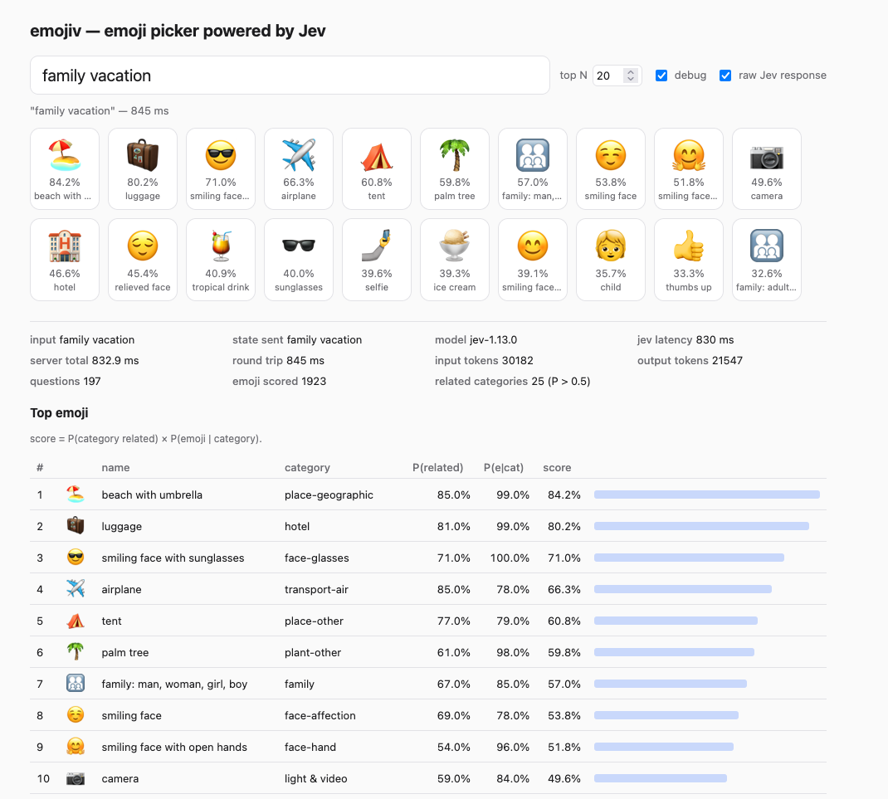

# emojiv

Picks emoji for a shortcode-style query (`:crying-face`, `:movie-about-dinosaurs`) using
[Jev](https://docs.typesafe.ai) (TypeSafe's `/v1/systemone` API).



```sh
export TYPESAFE_API_KEY=...
go run .    # http://localhost:8080
```

## How it works

The query is normalized (`:movie-about-dinosaurs` → `movie about dinosaurs`) and sent in
the `state` (together with shared context) of a single Jev request. Emoji are grouped into
99 buckets by Unicode subgroup (subgroups over Jev's 255-option Choice limit are split), and
each bucket gets two questions, all evaluated in parallel:

- `related:<id>` — Noul: would an emoji from this category fit a message about the text?
- `bucket:<id>` — Choice: which emoji in this category is most associated with the text?

Each emoji is scored `P(related) × P(emoji | bucket)`. The Noul answers are independent, so
several categories can score high at once. (A single Choice over categories put 100% on one
category, which hid every other association.) Results are cached in memory per query.

Endpoints: `GET /api/search?q=&n=&raw=1`, `GET /api/request?q=` (shows the Jev request body).
Emoji data: `data/emoji-test.txt` from unicode.org (fully-qualified, skin tones excluded).
Keywords for the embedding backend: `data/cldr-annotations*-en.xml` from Unicode CLDR.
To update them to the latest Unicode data, run `go generate`, which downloads them again.

## Embedding backend (prototype)

A second backend ranks emoji locally with [EmbeddingGemma 2](https://huggingface.co/google/embeddinggemma-2):
it embeds every emoji once, embeds the query, and sorts by cosine similarity. Each emoji has two
vectors, its name and its name plus [CLDR keywords](https://cldr.unicode.org/translation/characters-emoji-symbols/short-names-and-keywords),
and scores as the better of the two. Variants of one emoji (gendered forms, family compositions,
clock faces) collapse into the best-matching one. The model runs inside the Go process through llama.cpp, loaded as a shared library by
[yzma](https://github.com/hybridgroup/yzma) (no cgo, no API key).

```sh
# llama.cpp libraries (needs a build from 2026-10-06 or later) and the 310 MB model
mkdir -p .local && cd .local
curl -L https://github.com/ggml-org/llama.cpp/releases/download/b11461/llama-b11461-bin-macos-arm64.tar.gz | tar xz
mv llama-b11461 llama
curl -LO https://huggingface.co/ggml-org/embeddinggemma-2-GGUF/resolve/main/embeddinggemma-2-Q8_0.gguf
cd ..

go run . -llama-lib .local/llama -embed-model .local/embeddinggemma-2-Q8_0.gguf
```

The first start embeds all emoji (about 40 s) and caches the vectors in the user cache
directory. With `TYPESAFE_API_KEY` also set, both backends are available and the UI has a
selector to switch between them (`backend=jev|embed` on `/api/search`).

## License

MIT, see [LICENSE](LICENSE). The files in `data/` are Unicode data, distributed under the
[Unicode License](https://www.unicode.org/terms_of_use.html).
